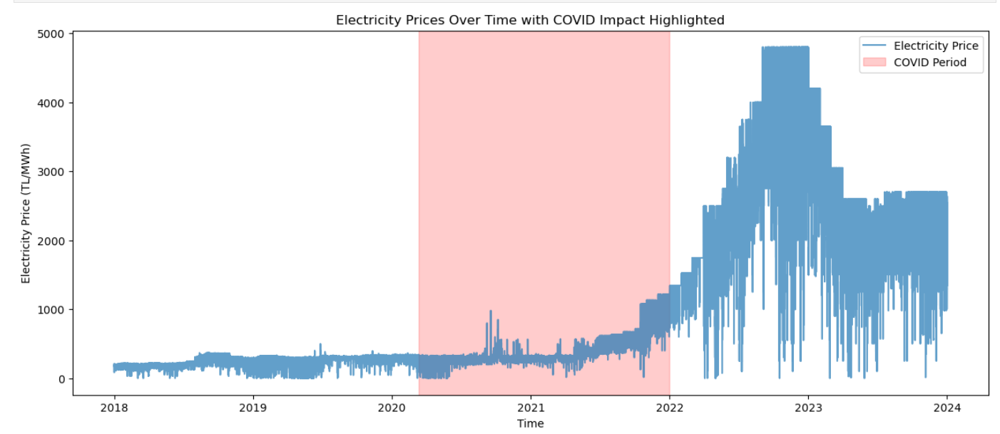
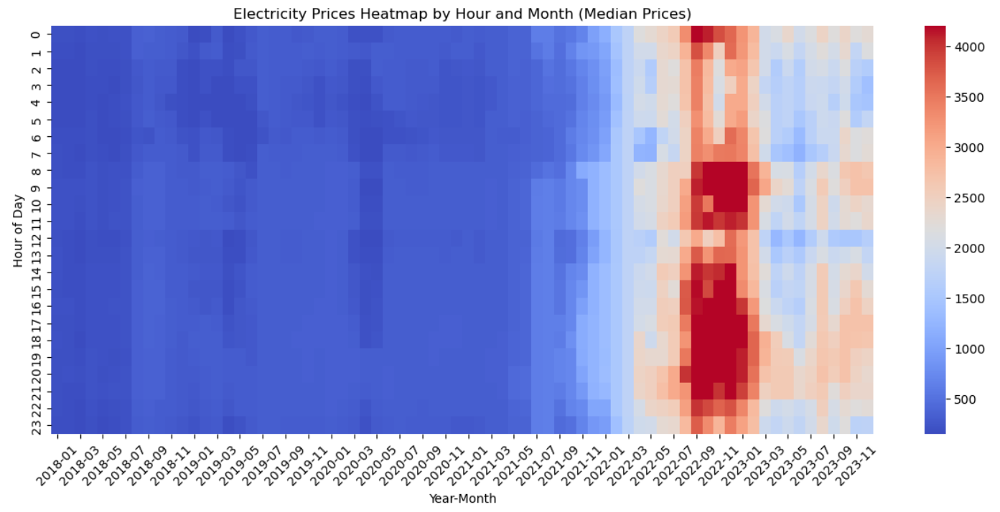
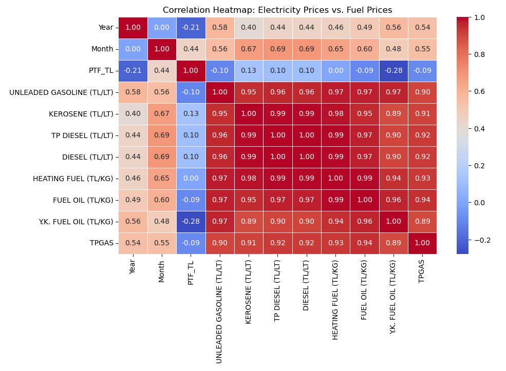

# ⚡ Electricity Price Trends in Turkey (2018–2023)

📈 A comprehensive data analytics project exploring electricity price trends in Turkey before, during, and after the COVID-19 pandemic.

---

## 📌 Project Overview

This project analyzes **weekly electricity prices in Turkey** from 2018 to 2023 using **exploratory data analysis (EDA)** and **regression-based forecasting**.

We investigate:
- 🔍 Seasonal trends and hourly/monthly patterns
- 🦠 The impact of **COVID-19** on electricity pricing
- ⛽ The correlation between **fuel prices and electricity prices**
- 🔮 Predictive modeling using regression techniques (Linear & Ridge)

---

## 🧾 Data Source

- 🗓️ Timeframe: 2018–2023 (weekly frequency)
- 📊 Data Provider: Turkish Electricity Market Operator
- 🔄 Preprocessing: Outlier removal, missing value imputation, feature engineering (e.g., month, hour), and COVID-19 indicator inclusion

---

## 📊 Key Visuals

| Description | Preview |
|------------|---------|
| Price trends over time with COVID impact |  |
| Heatmap of electricity prices by hour/month |  |
| Correlation matrix of fuel vs. electricity prices |  |

---

## 🔧 Modeling

- ✅ **Regression Techniques:** Linear & Ridge Regression
- 📉 Metrics: R² and MAPE
- 📌 Key Finding: COVID-19 and fuel prices significantly impact electricity pricing in Turkey

---

## 💡 Insights

- Electricity prices were relatively stable pre-2020, with clear seasonal patterns.
- During COVID-19, prices became volatile due to demand shifts and fuel market disruptions.
- Strong correlation observed between fuel prices (diesel, kerosene) and electricity prices.
- Ridge Regression with a COVID-19 indicator showed the best performance (R² ≈ 0.587).

---

## 👨‍💻 Author

**Meriç Utku Sokat**  
📚 Bilkent University

---

## 📚 References

- Turkish Electricity Market Data Portal
- Publicly available fuel price datasets
